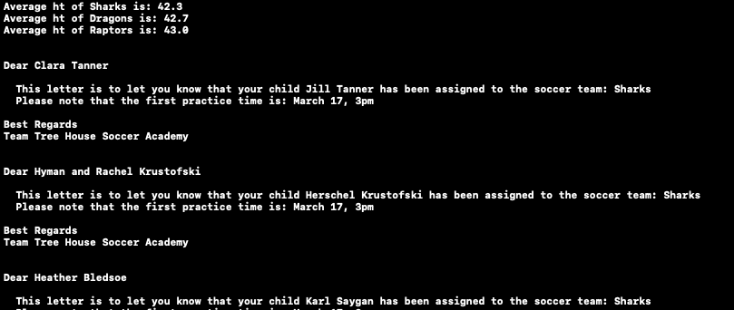

# Team Treehouse TechDegree Project 1

## Soccer League Coordinator

**App Description:**  Soccer Team Coordinator app.  Capture player data; assign players evenly to 3 teams so that each team has equivalent average heights; print an automated mail-out to guardians

**Swift Features Used:** 
Native types and collections (Dictionary, Array, Int, String, etc), Control flow, Comparison operators, String interpolation, Commenting.

**Screenshots:** 

